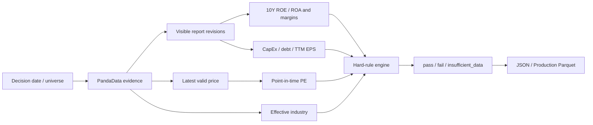

<div align="center">

# Buffett Moat Screener

**Lavine Version · Q44**

An auditable, point-in-time, fail-closed Buffett moat hard screener for Shanghai and Shenzhen A-shares using PandaData evidence.

**English** · [简体中文](README.md)

[](https://github.com/lavine888/skill-buffett-moat-screener/actions/workflows/validate.yml)


[](LICENSE)

</div>

---

## What it does

This project implements a hard conjunction of quality and valuation rules. It is not a soft score and does not promote incomplete evidence.

- **Point-in-time** reports, prices, industries, and universes.
- **Fail closed** on missing, conflicting, or invalid evidence.
- **Auditable revisions** through announcement dates and `if_adjusted` flags.
- **Resumable full-market runs** with throttling, concurrency, and atomic caches.
- **Versioned production output** in strict JSON and upsert-safe Parquet.

> The current production scope is Shanghai and Shenzhen (`.SH` and `.SZ`). Beijing Stock Exchange securities are outside this version.

## Pipeline



## Hard rules

### Ordinary companies

| Dimension | Requirement |
|---|---:|
| Latest ROE | `>= 15%` |
| 10-year ROE floor | Every year `>= 12%` |
| Latest gross margin | `>= 40%` |
| Margin stability | 10-year population standard deviation `< 10%` |
| Profit | Parent net profit `> 0` |
| Capital intensity | `abs(CapEx) / parent profit < 30%` |
| Long-term debt | `(long-term borrowing + bonds payable + non-current liabilities due within one year) / parent profit < 4` |
| Valuation | Point-in-time TTM PE `> 0` and `< 25` |

### Banks

Banks use a dedicated ROA branch. Industrial margin, CapEx, and debt gates are not applicable.

| Dimension | Requirement |
|---|---:|
| Latest ROA | `>= 1%` |
| 10-year ROA floor | Every year `>= 0.6%` |
| Profit | Parent net profit `> 0` |
| Valuation | Point-in-time TTM PE `> 0` and `< 25` |

## Three-state output

| Status | Meaning |
|---|---|
| `pass` | Every applicable hard rule passed. |
| `fail` | Evidence is complete and at least one rule explicitly failed. |
| `insufficient_data` | Evidence is missing, conflicting, invalid, or historically incomplete. |

Known nonpositive profit or EPS is a rule failure, not missing data.

## Quick start

```powershell
git clone https://github.com/lavine888/skill-buffett-moat-screener.git
Set-Location skill-buffett-moat-screener

python -m pip install -r requirements.txt
$env:PANDA_DATA_USERNAME = "your-account"
$env:PANDA_DATA_PASSWORD = "your-password"

python scripts/build.py `
  --as-of 20251231 `
  --symbols 600519.SH 000001.SZ `
  --json-output output/sample.json `
  --parquet-output output/sample.parquet
```

## Full SH/SZ run

```powershell
python scripts/build.py `
  --as-of 20251231 `
  --all-sh-sz `
  --cache-dir output/panda-cache `
  --request-interval 1.2 `
  --workers 8 `
  --json-output output/screen-20251231.json `
  --parquet-output production/database.parquet
```

Cache namespaces bind API parameters, SDK, provider environment, anonymous account identity, and the report-field contract. Re-running the same command resumes completed requests.

## Validation

```powershell
python -m pip install -r requirements-dev.txt
python -m pytest -q
node scripts/validate-qsh-form.mjs SKILL.md
python scripts/validate.py output/screen-20251231.json
python scripts/validate.py production/database.parquet
```

The 36 tests cover rule boundaries, point-in-time revisions, three-state semantics, provider contracts, cache manifests, concurrent authentication, production upserts, strict JSON/Parquet validation, and annual diagnostics.

## Validated snapshot

Rules and schema `1.2.0`, as of `2025-12-31`:

| Metric | Count |
|---|---:|
| SH/SZ universe | 5,182 |
| `pass` | 17 |
| `fail` | 3,386 |
| `insufficient_data` | 1,779 |
| Price coverage | 5,182 / 5,182 |
| Industry coverage | 5,180 / 5,182 |

This snapshot validates full-market execution and the production contract. It is not historical performance evidence or investment advice. Generated market data, caches, and Parquet artifacts are excluded from Git by default.

## Repository layout

```text
lavine_buffett/        Rules, PandaData client, service, materialization, diagnostics
scripts/               build / validate / backtest entry points
tests/                 Rules, provider, service, and production-contract tests
references/            Field guide, methodology freeze, source boundary
production/SKILL.md    Production-result reader contract
SKILL.md               Agent Skill entry point and qsh-form
```

## Documentation

- [Field and calculation guide](references/data_guide.md)
- [Methodology freeze](references/methodology.md)
- [Source boundary](references/source_boundary.md)
- [Changelog](CHANGELOG.md)

## Disclaimer

This project is for research and education only. It is not affiliated with Warren Buffett, Berkshire Hathaway, PandaAI, or QUANTSKILLS. Screening results are not investment advice, verified performance, or trading instructions.

## License

[GNU General Public License v3.0](LICENSE)
