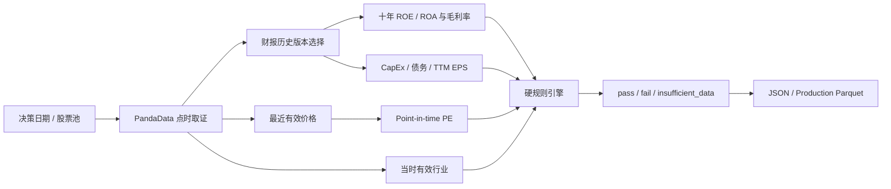

<div align="center">

# Buffett Moat Screener

**Lavine Version · 量枢院 Q44**

基于 PandaData 点时证据，对沪深 A 股执行可审计、可复现、缺失即拒绝的巴菲特护城河硬筛选。

[English](README.en.md) · **简体中文**

[](https://github.com/lavine888/skill-buffett-moat-screener/actions/workflows/validate.yml)


[](LICENSE)

</div>

---

## 项目定位

这个 Skill 实现的是硬条件交集，不是软评分，也不是“差不多合格”的候选推荐器。

- **Point-in-time**：财报、价格、行业和股票池都按决策日重建。
- **Fail closed**：缺失、冲突或非法证据返回 `insufficient_data`，不会填零或猜测。
- **版本可审计**：保留公告日期、`if_adjusted`、TTM 组成日期和规则检查结果。
- **可恢复运行**：PandaData 请求支持节流、并发、原子缓存和断点续跑。
- **生产契约**：输出严格 JSON 和可按复合键 upsert 的 Parquet。

> 当前生产范围是沪深市场，即 `.SH` 与 `.SZ`。CLI 使用语义明确的 `--all-sh-sz`；北交所不在本版本范围内。

## 工作流程



## 筛选规则

### 普通公司

| 维度 | 硬条件 |
|---|---:|
| 最新 ROE | `>= 15%` |
| 十年 ROE 下限 | 最近连续十年每年 `>= 12%` |
| 最新毛利率 | `>= 40%` |
| 毛利率稳定性 | 十年总体标准差 `< 10%` |
| 盈利 | 归母净利润 `> 0` |
| 资本开支 | `abs(CapEx) / 归母净利润 < 30%` |
| 长期有息负债 | `长期借款 + 应付债券 + 一年内到期非流动负债`，除以归母净利润 `< 4` |
| 估值 | Point-in-time TTM PE `> 0` 且 `< 25` |

### 银行

银行不套用工业企业的毛利率、CapEx 和长期债务门槛：

| 维度 | 硬条件 |
|---|---:|
| 最新 ROA | `>= 1%` |
| 十年 ROA 下限 | 最近连续十年每年 `>= 0.6%` |
| 盈利 | 归母净利润 `> 0` |
| 估值 | Point-in-time TTM PE `> 0` 且 `< 25` |

## 三态结果

| 状态 | 含义 |
|---|---|
| `pass` | 所有适用硬规则均通过，可进入筛选结果。 |
| `fail` | 数据完整，但至少一条适用规则明确失败。 |
| `insufficient_data` | 数据缺失、日期非法、行业未知、历史断档或版本冲突，拒绝推断。 |

非正利润或非正 EPS 是已知规则失败，不会被误报为数据缺失。

## 快速开始

### 1. 安装

```powershell
git clone https://github.com/lavine888/skill-buffett-moat-screener.git
Set-Location skill-buffett-moat-screener

python -m pip install -r requirements.txt
$env:PANDA_DATA_USERNAME = "your-account"
$env:PANDA_DATA_PASSWORD = "your-password"
```

两份依赖文件的用途：

- `requirements.txt`：**运行时依赖**，运行筛选 CLI、规则引擎、PandaData 提供者与 JSON/Parquet 物化所需；
- `requirements-dev.txt`：**开发与测试依赖**，在运行时依赖之外追加 `pytest`，仅本地开发、`pytest` 与 CI 校验使用。

### 2. 筛选指定股票

```powershell
python scripts/build.py `
  --as-of 20251231 `
  --symbols 600519.SH 000001.SZ `
  --json-output output/sample.json `
  --parquet-output output/sample.parquet
```

### 3. 使用冻结股票池

CSV 需要包含 `symbol` 列；文本文件则每行一个代码。

```powershell
python scripts/build.py `
  --as-of 20251231 `
  --symbols-file universe.csv `
  --cache-dir output/panda-cache `
  --request-interval 1.2 `
  --workers 8 `
  --json-output output/screen.json `
  --parquet-output output/screen.parquet
```

### 4. 全沪深市场

```powershell
python scripts/build.py `
  --as-of 20251231 `
  --all-sh-sz `
  --cache-dir output/panda-cache `
  --request-interval 1.2 `
  --workers 8 `
  --json-output output/screen-20251231.json `
  --parquet-output production/database.parquet
```

请求缓存按 API、参数、SDK、接口环境、匿名账号和字段契约隔离。中断或限流后重复同一命令即可复用已完成请求。

## 输出与审计

### 顶层 JSON

- `counts`：三态数量；
- `diagnostics`：数据不足原因、失败规则、行业和价格覆盖；
- `selected_symbols`：通过全部硬规则的代码；
- `dataset_version`、`universe_hash`、`source_snapshot`；
- `runtime_versions` 与规则配置哈希。

### 每只股票

- 十年覆盖年份与公告日期；
- 原始/重列财报标志；
- ROE/ROA、毛利率、CapEx、债务和 PE；
- 每条规则的 `true / false / null`；
- 冲突季度和数据不足原因。

### Production Parquet

主键为 `trade_date + factor_id + symbol`。默认写入执行 upsert 并保留其他日期；子集运行不能写 canonical `production/database.parquet`，整库替换必须显式使用 `--replace-production`。

```powershell
python scripts/validate.py output/screen-20251231.json
python scripts/validate.py production/database.parquet
```

## 已验证快照

`2025-12-31`、规则与 schema `1.2.0`：

| 指标 | 数量 |
|---|---:|
| 沪深股票池 | 5,182 |
| `pass` | 17 |
| `fail` | 3,386 |
| `insufficient_data` | 1,779 |
| 价格证据覆盖 | 5,182 / 5,182 |
| 行业证据覆盖 | 5,180 / 5,182 |

该快照用于验证全市场执行、数据质量诊断和生产契约，不代表历史收益或投资建议。生成的全市场数据、缓存与 Parquet 默认不进入 Git。

## 测试

```powershell
python -m pip install -r requirements-dev.txt
python -m pytest -q
node scripts/validate-qsh-form.mjs SKILL.md
```

当前包含 37 项测试，覆盖：

- 阈值边界、十年连续性和银行分支；
- 未来版本、同日冲突和 `if_adjusted`；
- 非正利润/EPS 与缺失数据三态；
- 行业有效期、股票池和价格日期；
- 缓存 manifest、并发认证和 API 窗口；
- JSON/Parquet 契约、生产 upsert 与防覆盖；
- 年度诊断换手率、成本、缺失前瞻收益和最大回撤；
- 端到端集成 smoke：build → JSON/Parquet 物化 → 双校验器。

## 项目结构

```text
lavine_buffett/        核心规则、PandaData、服务、物化、年度诊断
scripts/               build / validate / backtest 标准入口
tests/                 规则、provider、服务、生产契约测试
references/            字段口径、方法冻结、数据源边界
production/SKILL.md    生产结果读取契约
SKILL.md               Agent Skill 入口与 qsh-form
```

## 方法与边界

- [字段与计算口径](references/data_guide.md)
- [方法冻结](references/methodology.md)
- [数据源边界](references/source_boundary.md)
- [版本记录](CHANGELOG.md)

## 免责声明

本项目仅用于研究与教育，不代表 Warren Buffett、Berkshire Hathaway、PandaAI 或 QUANTSKILLS 官方，与其无隶属关系。筛选结果不是投资建议，不验证收益声明，也不构成交易指令。

## License

[GNU General Public License v3.0](LICENSE)
